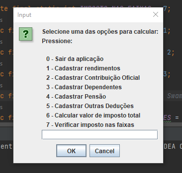
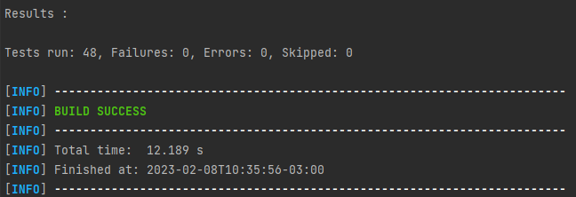

# Técnicas de Programação para Plataformas Emergentes - TPPE

## Alunos
|GRUPO 01| |
| - | - |
|**Matrícula** | **Aluno** |
| 16/0000572  | Adrian Soares Lopes |
| 19/0025298  | Bianca Sofia Brasil |
| 19/0046091  | Gustave Augusto Persijn |
| 17/0034992  | Gustavo Afonso Pires |
| 18/0113992  | Lorrany Oliveira |
| 19/0032863  | Lorrayne Alves Cardozo |


# ◻️ TP01
## Test Driven Development - TDD
Com base no funcionamento do cálculo do IRPF, o trabalho realizado pelo grupo consiste na criação de um simulador similar ao simulador disponibilizado pela RFB. Esse simulador foi construído através do método de TDD utilizando as técnicas de falsificação, duplicação e triangulação de testes.

### Como rodar o projeto
Após clonar o repositório, é necessário abrir o arquivo localizado em `/calculadoraIRPF/src/main/java/org/tppe/tp1/App.java` e rodar com a IDE de preferência.



### Como rodar os testes
Os testes estão localizados no diretório `/calculadoraIRPF/src/test/java/org/tppe/tp1`, e podem ser executados pela própria IDE, ou utilizando o Maven.

Para rodá-los utilizando o Maven, é necessário entrar na pasta `/calculadoraIRPF`, onde se encontra o arquivo `pom.xml`, e executar o comando no terminal:
```bash
mvn test
```

Por fim, o resultado dos testes:


# ◻️ TP02

As seguintes refatorações foram sugeridas:

|   **Operação de Refatoração**  |   **Local a ser refatorado**  |
|:-------------------------------|:------------------------------|
| Extrair método                 |Todas ocorrências isLimiteValido|
|Substituir método p/ met. objeto|CadastrarContribuicao.add()    |
| Extrair constante              |ContribuicaoPrevidenciaria, Deducao, Pensao, Rendimento.|


Os commits se encontram na branch [refatoracao](https://github.com/TrabalhosTecProg/Trabalho-TDD/tree/refatoracao/calculadoraIRPF).


# ◻️ TP03

Foram escolhidas 6 características de um bom projeto de software para o trabalho, que pode ser encontrado no [arquivo](https://github.com/TrabalhosTecProg/Trabalho-TDD/blob/TP3/calculadoraIRPF/TP3/TP3.md) localizado em `/calculadoraIRPF/TP3/TP3.md` .