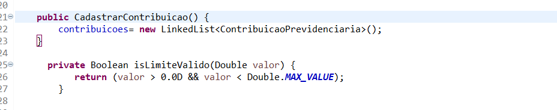
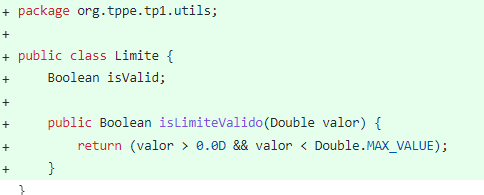
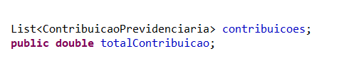
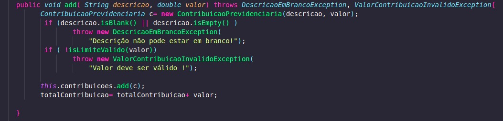
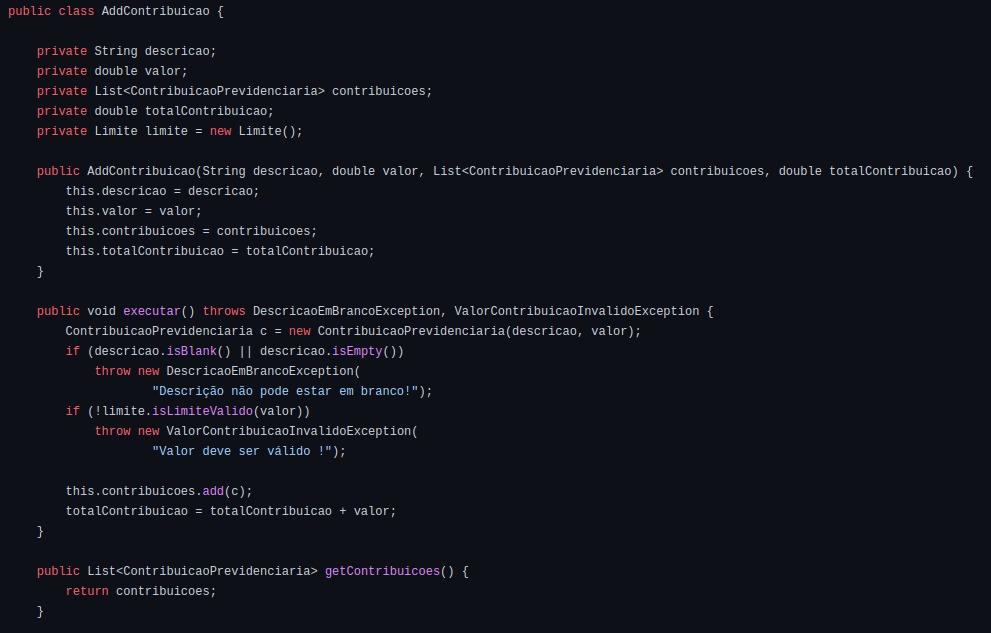

As 5 características escolhidas pelo grupo foram:

1. Simplicidade;
2. Ausência de Duplicidade;
3. Elegância;
4. Modularidade;

# 1. Simplicidade
## 1.1 Descrição

A simplicidade dos códigos de software é uma característica fundamental na construção de sistemas de alta qualidade. De acordo com a norma ABNT NBR ISO/IEC 9126-1, a simplicidade é definida como uma medida de facilidade de uso e compreensão do software. Código simples é mais fácil de entender, manter e modificar, reduzindo erros e tempo gasto em correções. Além disso, a simplicidade também ajuda a garantir a escalabilidade do software, o que facilita a inclusão de novos recursos no futuro. Em suma, a simplicidade dos códigos de software é essencial para  a eficiência, confiabilidade e manutenibilidade dos sistemas.

Existem diversas operações que ajudam a atingir uma boa simplicidade do código. Sendo algumas operações de refatorações como: dividir métodos longos, reduzir classes inchadas, extrair métodos, fazer uso de nomes claros para as variáveis. Dessa forma, a característica de simplicidade poderia ser aplicada ao fazer a extração de método do isLimiteValido em todas as suas ocorrências. Essa operação inclusive também colabora com a redução da duplicidade que será abordada posteriormente.

## 1.2 Aplicação

A simplicidade foi explorada com a extração de método do isLimiteValido que aparece em diversas classes, deixando o código mais fácil de entender e mais simples. A refatoração está disponível na branch 'refatoracao' referente ao TP2. Também explorada com o uso de nomes claros de variáveis.

<figcaption>Método repetido em várias classes</figcaption>

<figcaption> Extração do método em classe separada </figcaption>

<figcaption>Nomes claros de variáveis </figcaption>

# 2. Ausência de Duplicidade

## 2.1 Descrição

Código duplicado é uma prática de programação ruim que ocorre quando o mesmo código é repetido várias vezes no mesmo programa. Isso torna o código confuso, difícil de manter e sujeito a erros, porque toda vez que o código precisa ser alterado, ele precisa ser alterado em todas as instâncias em que ocorre. Além disso, a duplicação de código aumenta o tamanho do arquivo e afeta negativamente o desempenho do programa. Com isso, a solução para a duplicidade de código é refatorar o código para criar funções ou classes reutilizáveis ​​e apropriadas, ou seja, a ausência de duplicidades.

## 2.2 Aplicação

A ausência de duplicidade foi exercida e explorada no trabalho 2 com a extração do código isLimite, que aparecia como método em diversas classes, sendo extraida e transformada em um classe. A refatoração desta característica pode ser encontrada na branch 'refatoracao' referente ao TP2.

<figcaption>Método repetido em várias classes</figcaption>

<figcaption> Extração do método em classe separada </figcaption>

# 3. Elegência

## 3.1 Descrição

A elegância na refatoração refere-se à capacidade de reescrever ou reorganizar o código de maneira clara, concisa e eficiente, sem alterar o comportamento pretendido do programa. Isso é importante porque ajuda a tornar o código fácil de entender, manter e estender, o que melhora a qualidade e a confiabilidade do programa. A refatoração otimizada também pode melhorar o desempenho e a eficiência do código porque a eliminação da duplicação de código, a simplificação da lógica e o aproveitamento de funções e classes existentes ajudam a evitar o desperdício de recursos de computação.

## 3.2 Aplicação 

A característica de elegência também foi aplicada no Trabalho 2, um exemplo foi na transformação de um método em método objeto, tornando mais fácil sua reutilização, organização do código, clareza e outros, sem alterar o comportamento do projeto. A refatoração desta característica também pode ser encontrada na branch 'refatoracao' referente ao TP2.

<figcaption> Método na classe Cadastrar Contribuição </figcaption>

<figcaption> Transformação em método objeto </figcaption>

# 4. Modularidade

## 4.1 Descrição
Modularidade é uma prática importante em um bom projeto de software visto que ajuda a manter o código organizado, legível e de fácil manutenção. Uma boa modularidade consiste em dividir o projeto em módulos ou componentes independentes, cada um com sua própria responsabilidade e interface pública bem definida. Isso tem vários efeitos positivos no código, tais como: fácil entendimento e navegação pelo código, aumentando a rastreabilidade; melhor coesão, facilitando a divisão do projeto e, consequentemente, a manutenção do mesmo; baixo acoplamento, visto que manter os módulos independentes faz com que evite dependências excessivas entre eles; reutilização, já que módulos bem projetados podem ser facilmente reutilizados economizando tempo e esforço.

Em resumo, a boa modularidade pode levar a um código mais organizado, claro, coeso, facilmente mantido e escalável, tornando o desenvolvimento de software mais eficiente e eficaz.

## 4.2 Aplicação 

No desenvolvimento dos trabalhos na disciplina, o grupo optou por utilizar a arquitetura Clean Architecture, que é uma arquitetura de projeto bem modularizada, em que basicamente há várias camadas de modelagem. A arquitetura busca separar a lógica de negócios da lógica estrutural, aumentando a independência e a coesão entre camadas, permitindo que a mudança não afete a lógica de negócio,visto que também possui baixo acoplamento. 

Um exemplo prático que utilizamos no decorrer dos trabalhos, pode ser analisado na imagem abaixo, em que as entidades são bem definidas e isoladas das funções de negócio, que ficam no diretório usecases, além do controller que faz a comunicação entre eles. Além do isolamento das exceptions e utils - para armazenar funções isoladas que podem ser úteis em várias partes do código.

 <a target='_blank' href='https://pt-br.imgbb.com/'>imagens de um site</a> 

# Referências

ABNT NBR ISO/IEC 9126-1:2001. Informática - Avaliação de qualidade de software - Parte 1: Modelo de avaliação. Brasília: ABNT, 2001.
